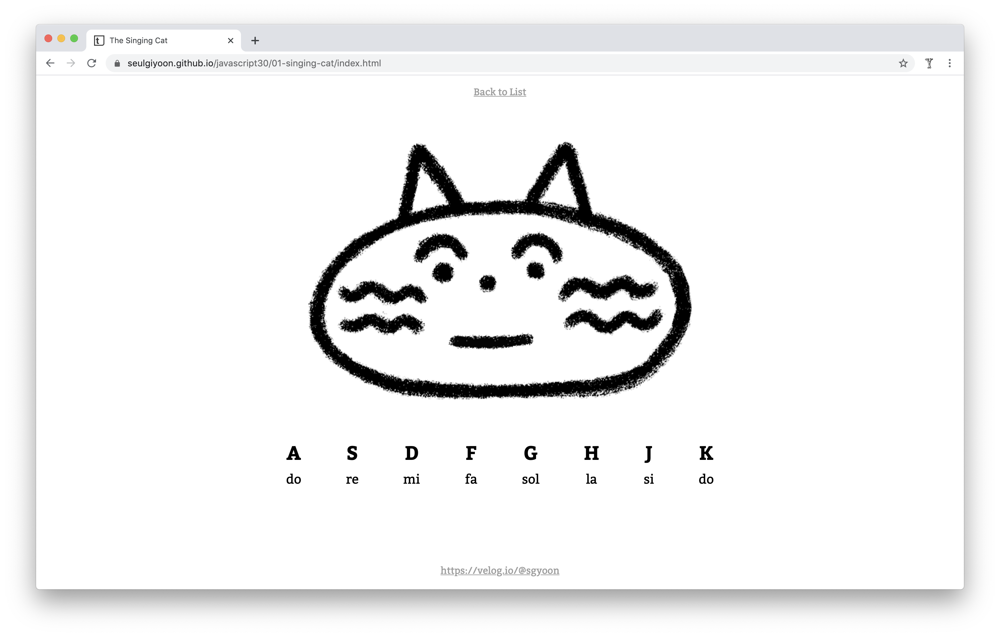
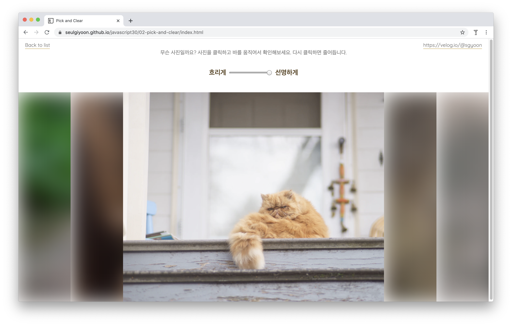

# Javascript30

Wes Bos의 무료 자바스크립트 학습 코스 [JavaScript 30](https://javascript30.com/)를 따라가면서, 새로 알게 된 지식을 이용해 작은 결과물을 만듭니다.

- 결과물 웹페이지 https://seulgiyoon.github.io/javascript30/

### The Singing Cat

영어 자판을 눌러 피아노를 쳐 보세요! 고양이가 함께합니다.

### Pick and Clear

흐릿한 이미지들... 무엇일까요? 바를 조정해 선명하게 만들어보세요.

